<!--
README de perfil GitHub - Dener Schmidt
Dica: substitua o link do LinkedIn em todos os pontos onde aparece SEU-LINKEDIN.
-->

<div align="center">


<br/>
<br/>

<a href="https://linkedin.com/in/SEU-LINKEDIN">
  
</a>
<a href="mailto:devdenerarturschmidt@gmail.com">
  
</a>
<a href="https://github.com/Dener-schmidt-dev">
  
</a>

<br/>
<br/>


</div>

---

## 🚀 Sobre mim

Sou **Desenvolvedor Full Stack** com experiência na construção e evolução de **plataformas ERP enterprise** — sistemas complexos que atendem vendas, fiscal, financeiro, estoque, e-commerce e integrações com marketplaces.

Trabalho diariamente com **arquitetura em camadas**, **APIs REST**, **front-end Angular**, **MongoDB** e **serviços distribuídos**, entregando features críticas de negócio com foco em **qualidade**, **performance** e **manutenibilidade**.

<br/>

<table>
  <tr>
    <td width="50%" valign="top">

### 🧠 `dener.ts`

```typescript
const dener = {
  role: "Full Stack Developer",
  location: "Brasil",
  focus: ["ERP", "Fiscal", "E-commerce", "Integrações"],
  stack: ["C#", ".NET 8", "Angular", "TypeScript", "MongoDB"],
  principles: ["Clean Architecture", "DTOs", "Code Review", "Performance"],
  currentlyLearning: ["IA aplicada a produto", "Otimização MongoDB", ".NET 8"],
  mission: "Construir soluções estáveis para problemas complexos"
};
```

  </td>
  <td width="50%" valign="top">

### ⚡ Meu foco no dia a dia

- Corrigir problemas com **raiz técnica**, não apenas sintomas  
- Criar features sem quebrar fluxos existentes  
- Cuidar de performance em telas, APIs e consultas MongoDB  
- Padronizar código para escalar produto enterprise  
- Entregar valor real para clientes e operação  

  </td>
  </tr>
</table>

---

## 📊 Painel rápido

<div align="center">

<table>
  <tr>
    <td align="center" width="20%">
      
      <br/><sub>Front-end enterprise</sub>
    </td>
    <td align="center" width="20%">
      
      <br/><sub>Monorepo e APIs</sub>
    </td>
    <td align="center" width="20%">
      
      <br/><sub>Domínio de negócio</sub>
    </td>
    <td align="center" width="20%">
      
      <br/><sub>Emissão fiscal</sub>
    </td>
    <td align="center" width="20%">
      
      <br/><sub>Automação e insights</sub>
    </td>
  </tr>
</table>

</div>

---

## 🧩 O que eu construo

<table>
  <tr>
    <td width="25%" valign="top">
      <h3>🛒 Vendas & PDV</h3>
      Fluxos de venda, ponto de venda, impressões, agrupamentos, pedidos e rotinas comerciais.
    </td>
    <td width="25%" valign="top">
      <h3>📄 Fiscal</h3>
      NF-e, NFC-e, NFS-e, MDF-e, CT-e, SPED, ACBr e integrações com regras fiscais.
    </td>
    <td width="25%" valign="top">
      <h3>💰 Financeiro</h3>
      Lançamentos, boletos, carnês, conciliação OFX, carteira, cobranças e notificações.
    </td>
    <td width="25%" valign="top">
      <h3>📦 Estoque</h3>
      Movimentações, depósitos, gestor de preços, custos, saldos e integrações de estoque.
    </td>
  </tr>
  <tr>
    <td width="25%" valign="top">
      <h3>🌐 E-commerce</h3>
      Integrações com marketplaces, sincronização de estoque, vendas, anúncios e pedidos.
    </td>
    <td width="25%" valign="top">
      <h3>🔌 APIs & Serviços</h3>
      REST, gRPC, SignalR, jobs em background, cache, filas, logs e serviços assíncronos.
    </td>
    <td width="25%" valign="top">
      <h3>🎨 Front-end</h3>
      Angular, componentes reutilizáveis, relatórios, autocompletes, dashboards e UX prática.
    </td>
    <td width="25%" valign="top">
      <h3>🧠 Arquitetura</h3>
      Camadas, DTOs, repositórios, padrões internos, code review e prevenção de regressão.
    </td>
  </tr>
</table>

---

## 🛠️ Stack & Ferramentas

<details open>
  <summary><b>Backend</b></summary>
  <br/>


</details>

<details open>
  <summary><b>Frontend</b></summary>
  <br/>


</details>

<details>
  <summary><b>Integrações & DevOps</b></summary>
  <br/>


</details>

---

## 🏗️ Arquitetura que aplico no dia a dia

<div align="center">



</div>

<details>
  <summary><b>🔎 Ver detalhes dos padrões que aplico</b></summary>
  <br/>

| Camada | Como aplico no dia a dia |
|:--|:--|
| **Front-end Angular** | Telas reutilizáveis com `BaseList`, `BaseEdit`, `BaseReport`, `ApiService`, filtros, dashboards e componentes padronizados. |
| **API .NET** | Separação por responsabilidade: `Controller → Service → Repository`, validações no backend e DTOs dedicados para entrada/saída. |
| **Serviços** | Jobs assíncronos, notificações, auditoria, integração fiscal, cache e rotinas de sincronização sem travar o fluxo principal. |
| **Dados & Performance** | MongoDB com índices alinhados aos filtros reais, Redis para cache e atenção a regressões em telas críticas. |
| **Integrações** | ACBr, SEFAZ, marketplaces, AWS S3, CloudFront, autenticação, certificados digitais e pipelines de publicação. |

</details>

**Padrões que sigo:** `Clean Architecture` · `DTOs` · `Code Review` · `Performance` · `Baixo risco de regressão` · `Reaproveitamento de componentes`

---

## 👾 Minhas contribuições — Pac-Man

<div align="center">

<!-- Gerado automaticamente pela action abozanona/pacman-contribution-graph -->
<picture>
  <source media="(prefers-color-scheme: dark)" srcset="https://raw.githubusercontent.com/Dener-schmidt-dev/Dener-schmidt-dev/output/pacman-contribution-graph-dark.svg">
  <source media="(prefers-color-scheme: light)" srcset="https://raw.githubusercontent.com/Dener-schmidt-dev/Dener-schmidt-dev/output/pacman-contribution-graph.svg">
  
</picture>

</div>

---

## 📈 GitHub Stats

<div align="center">


<br/>
<br/>


<br/>
<br/>


</div>

---

## ⭐ Projetos em destaque

<table>
  <tr>
    <td width="25%" valign="top">
      <h3>🔧 Sistema ERP</h3>
      Plataforma full stack de gestão empresarial com vendas, fiscal, financeiro, estoque e integrações.
      <br/><br/>
      
      
      
    </td>
    <td width="25%" valign="top">
      <h3>🛒 E-commerce Integrator</h3>
      Integração com marketplaces, sincronização de estoque, vendas, pedidos e anúncios.
      <br/><br/>
      
      
    </td>
    <td width="25%" valign="top">
      <h3>📄 Emissão Fiscal</h3>
      Integrações fiscais com NF-e, NFS-e, MDF-e e comunicação com serviços externos.
      <br/><br/>
      
      
      
    </td>
    <td width="25%" valign="top">
      <h3>🤖 Módulo IA</h3>
      Features de inteligência artificial aplicadas ao ERP para automação e produtividade.
      <br/><br/>
      
      
      
    </td>
  </tr>
</table>

---

## 🧪 Destaques técnicos

- **Monorepo enterprise** com 100+ projetos .NET e front-end Angular multi-módulo
- **+280 telas** compartilhando bases como `BaseList`, `BaseEdit` e `BaseReport`
- **Emissão fiscal** integrada via ACBr: NF-e, NFS-e, MDF-e e NFCom
- **E-commerce integrator** com sincronização de estoque, pedidos e anúncios
- **Deploy** em CDN com S3 + CloudFront e pipelines de homologação/produção
- **Serviços assíncronos** para notificações, auditoria, indexação MongoDB e certificados digitais
- **IA aplicada** em módulos de produto e automações internas

---

## 📬 Vamos conversar?

<div align="center">

Estou aberto a colaborações, networking e oportunidades em **desenvolvimento enterprise**, **integrações fiscais** e **produtos SaaS**.

<br/>

<a href="mailto:devdenerarturschmidt@gmail.com">
  
</a>
<a href="https://linkedin.com/in/SEU-LINKEDIN">
  
</a>

<br/>
<br/>

> **Código limpo não é luxo — é o que permite escalar um ERP sem quebrar centenas de telas.**

</div>

---

<div align="center">
  <sub>Última atualização: Julho/2026</sub>
  <br/>
  
</div>
