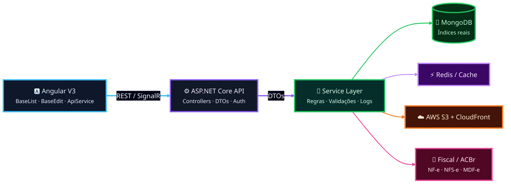

```mermaid
%%{init: {
  "theme": "base",
  "themeVariables": {
    "background": "#0d1117",
    "primaryColor": "#111827",
    "primaryTextColor": "#f8fafc",
    "primaryBorderColor": "#38bdf8",
    "lineColor": "#6366f1",
    "fontFamily": "Fira Code, Segoe UI, Arial"
  }
}}%%

flowchart LR
    A["🔎 Entender<br/>regra real"] --> B["📍 Encontrar<br/>ponto certo"]
    B --> C["♻️ Reaproveitar<br/>padrões"]
    C --> D["🛠️ Implementar<br/>menor impacto"]
    D --> E["✅ Validar<br/>regressão"]
    E --> F["🚀 Deploy<br/>seguro"]

    classDef step1 fill:#082f49,stroke:#38bdf8,color:#e0f2fe,stroke-width:3px;
    classDef step2 fill:#1e1b4b,stroke:#8b5cf6,color:#ede9fe,stroke-width:3px;
    classDef step3 fill:#052e16,stroke:#22c55e,color:#dcfce7,stroke-width:3px;
    classDef step4 fill:#431407,stroke:#f97316,color:#ffedd5,stroke-width:3px;
    classDef step5 fill:#450a0a,stroke:#ef4444,color:#fee2e2,stroke-width:3px;
    classDef step6 fill:#0f172a,stroke:#facc15,color:#fef9c3,stroke-width:3px;

    class A step1;
    class B step2;
    class C step3;
    class D step4;
    class E step5;
    class F step6;

    linkStyle 0 stroke:#38bdf8,stroke-width:3px;
    linkStyle 1 stroke:#8b5cf6,stroke-width:3px;
    linkStyle 2 stroke:#22c55e,stroke-width:3px;
    linkStyle 3 stroke:#f97316,stroke-width:3px;
    linkStyle 4 stroke:#facc15,stroke-width:3px;
```

```mermaid
%%{init: {
  "theme": "base",
  "themeVariables": {
    "background": "#0d1117",
    "primaryColor": "#111827",
    "primaryTextColor": "#f8fafc",
    "primaryBorderColor": "#38bdf8",
    "lineColor": "#6366f1",
    "fontFamily": "Fira Code, Segoe UI, Arial"
  }
}}%%

flowchart LR
    A["🔎 Raiz do problema"] --> B["🎯 Menor impacto"]
    B --> C["🧬 Padrão do projeto"]
    C --> D["⚡ Performance"]
    D --> E["🛡️ Regressão"]
    E --> F["🚀 Deploy seguro"]

    classDef a fill:#082f49,stroke:#38bdf8,color:#e0f2fe,stroke-width:3px;
    classDef b fill:#1e1b4b,stroke:#8b5cf6,color:#ede9fe,stroke-width:3px;
    classDef c fill:#052e16,stroke:#22c55e,color:#dcfce7,stroke-width:3px;
    classDef d fill:#431407,stroke:#f97316,color:#ffedd5,stroke-width:3px;
    classDef e fill:#450a0a,stroke:#ef4444,color:#fee2e2,stroke-width:3px;
    classDef f fill:#0f172a,stroke:#facc15,color:#fef9c3,stroke-width:3px;

    class A a;
    class B b;
    class C c;
    class D d;
    class E e;
    class F f;

    linkStyle 0 stroke:#38bdf8,stroke-width:3px;
    linkStyle 1 stroke:#8b5cf6,stroke-width:3px;
    linkStyle 2 stroke:#22c55e,stroke-width:3px;
    linkStyle 3 stroke:#f97316,stroke-width:3px;
    linkStyle 4 stroke:#facc15,stroke-width:3px;
```

<div align="center">


<br/>

### Desenvolvedor Full Stack focado em **ERP enterprise**, **integrações fiscais** e **produtos SaaS**

<br/>

[](https://linkedin.com/in/SEU-LINKEDIN)
[](mailto:devdenerarturschmidt@gmail.com)
[](https://github.com/Dener-schmidt-dev)

<br/>


</div>

---

<table>
<tr>
<td width="50%">

### 🚀 Sobre mim

Trabalho com evolução de sistemas **ERP de grande escala**, atuando em módulos de vendas, fiscal, financeiro, estoque, e-commerce, APIs e serviços em background.

Tenho foco em entregar soluções com **baixo risco de regressão**, reaproveitando padrões existentes e mantendo código simples, performático e sustentável.

</td>
<td width="50%">

```typescript
const dener = {
  role: "Full Stack Developer",
  stack: [".NET", "Angular", "MongoDB"],
  focus: ["ERP", "Fiscal", "SaaS", "Integrações"],
  mindset: ["Clean Code", "Performance", "Baixo risco"],
  current: "Construindo soluções que escalam negócios"
};
```

</td>
</tr>
</table>

---

## ⚡ Visão rápida

<div align="center">


<br/>


</div>

<br/>

<details open>
<summary><b>🚀 Painel executivo</b></summary>

<br/>

<table>
<tr>
<td width="50%" valign="top">

### 🧩 Produto Enterprise
- ERP com vendas, financeiro, fiscal, estoque, PDV e relatórios
- Fluxos críticos de negócio com foco em estabilidade
- Evolução sem quebrar telas e rotinas existentes

</td>
<td width="50%" valign="top">

### 📄 Fiscal & Integrações
- NF-e, NFC-e, NFS-e, MDF-e, CT-e, SPED e ACBr
- Integrações com marketplaces, APIs externas e serviços internos
- Certificados, automações, jobs e validações de regra

</td>
</tr>
<tr>
<td width="50%" valign="top">

### 🅰️ Front-end
- Angular, TypeScript, dashboards e telas CRUD
- Componentes base reutilizáveis
- Autocompletes, relatórios e experiência de uso

</td>
<td width="50%" valign="top">

### ⚙️ Back-end & Infra
- APIs REST, services, repositories, jobs e MongoDB
- GitHub Actions, AWS S3, CloudFront e deploy seguro
- Performance, logs, auditoria e baixo risco de regressão

</td>
</tr>
</table>

</details>

<details open>
<summary><b>🎯 Como eu penso uma entrega</b></summary>

<br/>



</details>

<div align="center">


</div>

---

## 🧠 Arquitetura na prática

<details open>
<summary><b>✨ Fluxo principal que aplico no dia a dia</b></summary>

<br/>



</details>

---

## 🛠️ Stack principal

<div align="center">


</div>

---

## 🧠 Padrões, stack e domínios

<div align="center">


<br/><br/>


</div>

---

<details open>
<summary><b>✅ Checklist técnico que sigo</b></summary>

<br/>



<div align="center">


</div>

</details>

<details open>
<summary><b>⚙️ Padrões técnicos</b></summary>

<br/>

<div align="center">


</div>

<br/>

<details>
<summary><b>🔍 Abrir explicação dos padrões</b></summary>

<br/>

- **Controller → Service → Repository:** separo responsabilidade e mantenho cada camada com seu papel.
- **DTOs dedicados:** evito acoplar entidade de banco diretamente no contrato da API.
- **Regra no backend:** front-end não decide regra crítica de negócio.
- **Componentes base:** reaproveito padrões do projeto para reduzir retrabalho e regressão.
- **Code review severo:** olho impacto, performance, regressão e compatibilidade com fluxos antigos.
- **MongoDB consciente:** penso em filtros reais, ordenação, paginação e índices antes de escalar a consulta.

</details>

</details>

---

## 🛠️ Stack por categoria

<div align="center">


<br/><br/>


</div>

<details>
<summary><b>📦 Ver detalhes da stack</b></summary>

<br/>

<div align="center">

### Backend


### Frontend


### Cloud, Dados e Domínio


</div>

</details>

---

## 📌 Projetos e domínios

<div align="center">


</div>

<br/>

<details open>
<summary><b>🔧 Sistema ERP</b></summary>

<br/>


Plataforma de gestão empresarial com módulos de vendas, fiscal, financeiro, estoque, relatórios e rotinas operacionais críticas.

</details>

<details>
<summary><b>🛒 E-commerce Integrator</b></summary>

<br/>


Integrações com marketplaces, sincronização de estoque, pedidos, anúncios e rotinas de atualização entre canais.

</details>

<details>
<summary><b>📄 Emissão Fiscal</b></summary>

<br/>


Integrações fiscais com ACBr, documentos fiscais, certificados digitais, validações e conformidade com regras de emissão.

</details>

<details>
<summary><b>🤖 Módulos com IA</b></summary>

<br/>


Recursos inteligentes aplicados ao ERP, atendimento, automações, análise de dados e apoio à tomada de decisão.

</details>

<details>
<summary><b>🚀 Deploy e Infra</b></summary>

<br/>


Homologação, produção, CDN, storage, APIs, monitoramento, publicações e cuidado com ambiente correto.

</details>

---

## 👾 Minhas contribuições

<div align="center">

<!-- Gerado automaticamente pela action abozanona/pacman-contribution-graph -->
<picture>
  <source media="(prefers-color-scheme: dark)" srcset="https://raw.githubusercontent.com/Dener-schmidt-dev/Dener-schmidt-dev/output/pacman-contribution-graph-dark.svg">
  <source media="(prefers-color-scheme: light)" srcset="https://raw.githubusercontent.com/Dener-schmidt-dev/Dener-schmidt-dev/output/pacman-contribution-graph.svg">
  
</picture>

</div>

---

## 📊 GitHub Analytics

<div align="center">


<br/><br/>


<br/><br/>


<br/><br/>


</div>

<details>
<summary><b>📌 Ver cards resumidos</b></summary>

<br/>

<div align="center">


</div>

</details>

<div align="center">


</div>

---

<div align="center">

### Vamos construir algo incrível?

Estou aberto para networking, colaborações e conversas sobre **ERP**, **SaaS**, **arquitetura**, **fiscal** e **produtos digitais**.

[](mailto:devdenerarturschmidt@gmail.com)
[](https://linkedin.com/in/SEU-LINKEDIN)

<br/>

> Código limpo não é luxo — é o que permite escalar um ERP sem quebrar centenas de telas.

<br/>


</div>
