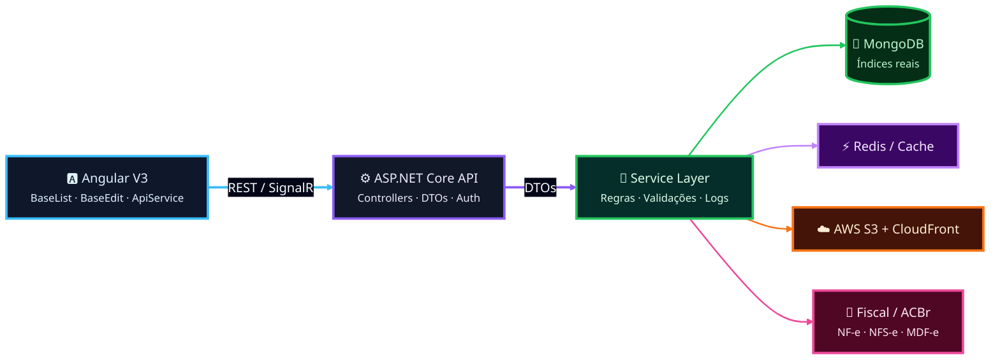

<div align="center">


<br/>

### Desenvolvedor Full Stack focado em **ERP enterprise**, **integrações fiscais** e **produtos SaaS**

<br/>

[](https://linkedin.com/in/SEU-LINKEDIN)
[](mailto:devdenerarturschmidt@gmail.com)
[](https://github.com/Dener-schmidt-dev)

<br/>


</div>

---

<table>
<tr>
<td width="50%">

### 🚀 Sobre mim

Trabalho com evolução de sistemas **ERP de grande escala**, atuando em módulos de vendas, fiscal, financeiro, estoque, e-commerce, APIs e serviços em background.

Tenho foco em entregar soluções com **baixo risco de regressão**, reaproveitando padrões existentes e mantendo código simples, performático e sustentável.

</td>
<td width="50%">

```typescript
const dener = {
  role: "Full Stack Developer",
  stack: [".NET", "Angular", "MongoDB"],
  focus: ["ERP", "Fiscal", "SaaS", "Integrações"],
  mindset: ["Clean Code", "Performance", "Baixo risco"],
  current: "Construindo soluções que escalam negócios"
};
```

</td>
</tr>
</table>

---

## ⚡ Visão rápida

<div align="center">

| 🧩 Área | 💼 Experiência |
|:--|:--|
| **ERP Enterprise** | Vendas, financeiro, fiscal, estoque, PDV e relatórios |
| **Fiscal** | NF-e, NFC-e, NFS-e, MDF-e, CT-e, SPED e ACBr |
| **Front-end** | Angular, TypeScript, telas CRUD, dashboards e autocompletes |
| **Back-end** | APIs REST, services, repositories, jobs, MongoDB e integrações |
| **Infra/Deploy** | GitHub Actions, AWS S3, CloudFront, ambientes de homologação/produção |

</div>

---

## 🧠 Arquitetura na prática

<details open>
<summary><b>✨ Fluxo principal que aplico no dia a dia</b></summary>

<br/>



</details>

<details>
<summary><b>⚙️ Padrões técnicos</b></summary>

<br/>

| Padrão | Como aplico |
|:--|:--|
| **Controller → Service → Repository** | Separação clara de responsabilidades |
| **DTOs dedicados** | Request/response sem acoplar entidade |
| **Regra no backend** | Front-end não decide regra crítica |
| **Componentes base** | Reaproveitamento e consistência visual |
| **Code review severo** | Foco em regressão, performance e manutenção |
| **MongoDB consciente** | Índices alinhados aos filtros reais da tela |

</details>

---

## 🛠️ Stack principal

<div align="center">


</div>

<details>
<summary><b>Ver stack por categoria</b></summary>

<br/>

| Categoria | Tecnologias |
|:--|:--|
| **Backend** | .NET 8, ASP.NET Core, C#, REST APIs, gRPC, SignalR, xUnit |
| **Frontend** | Angular, TypeScript, RxJS, SCSS, Bootstrap, ECharts |
| **Banco/Cache** | MongoDB, Redis |
| **Cloud/Deploy** | AWS S3, CloudFront, GitHub Actions |
| **Domínio** | ERP, Fiscal, ACBr, Mercado Livre, Pagarme, OAuth2 |

</details>

---

## 👾 Minhas contribuições

<div align="center">

<!-- Gerado automaticamente pela action abozanona/pacman-contribution-graph -->
<picture>
  <source media="(prefers-color-scheme: dark)" srcset="https://raw.githubusercontent.com/Dener-schmidt-dev/Dener-schmidt-dev/output/pacman-contribution-graph-dark.svg">
  <source media="(prefers-color-scheme: light)" srcset="https://raw.githubusercontent.com/Dener-schmidt-dev/Dener-schmidt-dev/output/pacman-contribution-graph.svg">
  
</picture>

</div>

---

## 📊 GitHub Stats

<div align="center">


<br/><br/>


</div>

---

## 📌 Projetos e domínios

<details open>
<summary><b>Áreas onde mais atuo</b></summary>

<br/>

| Projeto/Domínio | O que envolve |
|:--|:--|
| 🔧 **Sistema ERP** | Plataforma de gestão empresarial com vendas, fiscal, financeiro e estoque |
| 🛒 **E-commerce Integrator** | Sincronização com marketplaces, estoque, pedidos e anúncios |
| 📄 **Emissão Fiscal** | NF-e, NFS-e, MDF-e, integrações ACBr e conformidade fiscal |
| 🤖 **Módulos com IA** | Recursos inteligentes aplicados ao produto e atendimento |
| 🚀 **Deploy e Infra** | Homologação, produção, CDN, storage, APIs e monitoramento |

</details>

---

<div align="center">

### Vamos construir algo incrível?

Estou aberto para networking, colaborações e conversas sobre **ERP**, **SaaS**, **arquitetura**, **fiscal** e **produtos digitais**.

[](mailto:devdenerarturschmidt@gmail.com)
[](https://linkedin.com/in/SEU-LINKEDIN)

<br/>

> Código limpo não é luxo — é o que permite escalar um ERP sem quebrar centenas de telas.

<br/>


</div>
